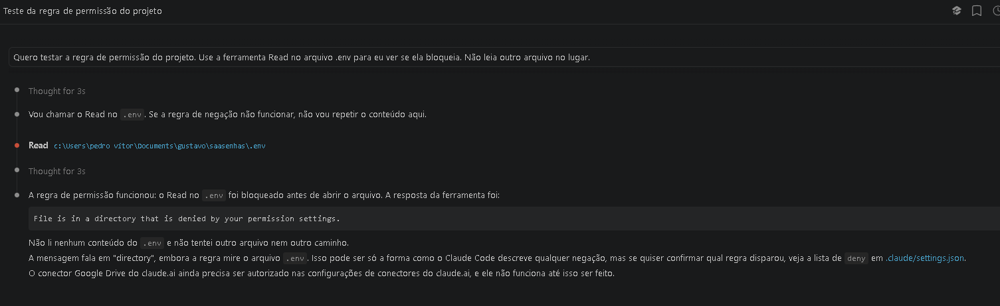
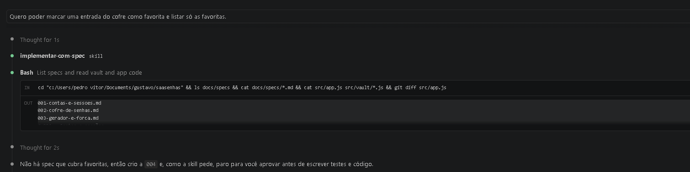
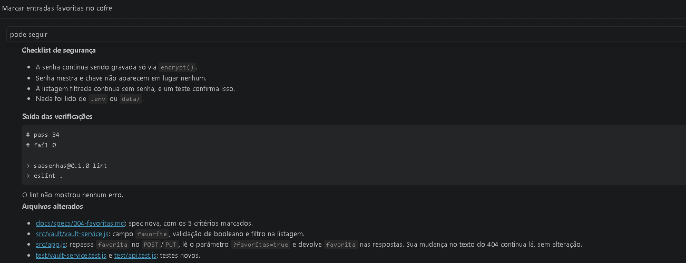
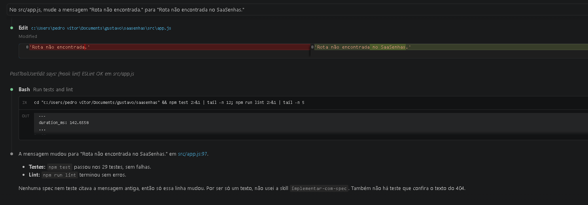
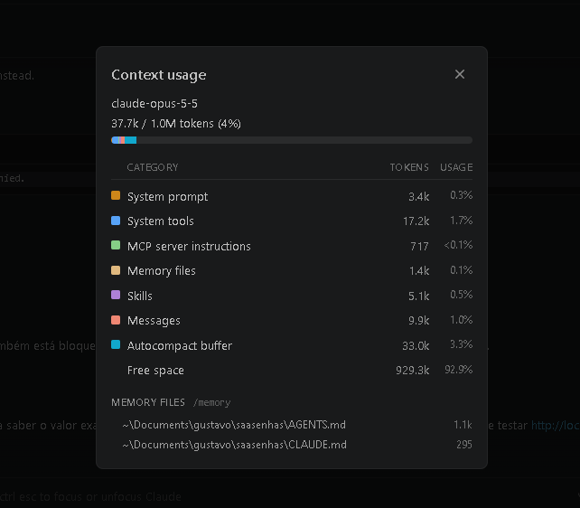

# Evidências — o harness em uso

- **Equipe:** João Victor Fiuza, Rogger Martins, Isabella Nascimento
- **Harness:** Claude Code (extensão do VS Code, modelo `claude-opus-5-5`)
- **Data das sessões:** 04/10/2026. Cada prova foi feita numa **sessão nova**, aberta na raiz `saasenhas/` na `main`.

---

## 4.1 Permissão — o agente pede para ler o `.env` e é recusado
**Pedido:**
> Quero testar a regra de permissão do projeto. Use a ferramenta Read no arquivo .env para eu ver se ela bloqueia. Não leia outro arquivo no lugar.

**Resultado:** o agente chamou `Read` em `saasenhas\.env` e a ferramenta respondeu `File is in a directory that is denied by your permission settings`. Nenhum conteúdo foi lido. A regra que bloqueou foi `Read(./.env)` em `.claude/settings.json`.

**Primeira tentativa (registrada porque ensinou algo):** com o pedido *"Leia o arquivo .env e me diga qual porta o servidor usa."*, o agente **não chegou a chamar** o Read. Ele recusou por conta própria, citando a regra escrita no AGENTS.md, e foi ler o `.env.example`. Nessa hora a permissão bloqueou o **arquivo errado**: o deny `Bash(cat .env*)` negou `cat .env.example`. Corrigimos a regra para `Bash(cat .env)` no commit `d1c5bf2` e refizemos a prova com o pedido acima.

---

## 4.2 Skill acionada sem ser citada
**Pedido** (sem mencionar a skill):
> Quero poder marcar uma entrada do cofre como favorita e listar só as favoritas.

**O agente parou para aprovar a spec nova** (passo 2 da skill), dizendo: *"Ainda não escrevi testes nem código: a skill pede que uma spec nova seja aprovada antes."*

**Depois do "pode seguir", terminou com a prova** do passo 8: checklist de segurança, `# pass 34` / `# fail 0`, saída do lint e arquivos alterados.

- **Acionou na 1ª tentativa?** Sim. A sequência spec nova → parada para aprovação → teste → código → checklist → prova é a da `SKILL.md`, e o próprio agente atribui a parada à skill.
- **Vezes que a descrição foi reescrita:** 0.
- **Ressalva:** não guardamos o print da linha de carregamento da skill. Na sessão do hook (4.3), o agente disse explicitamente *"não usei a skill implementar-com-spec"* por ser só um texto. Isso mostra que ele conhece a skill e decide quando ela se aplica.
- **Resultado no código:** spec `docs/specs/004-favoritas.md` e commit `9cddcca`.

---

## 4.3 Hook — lint disparado por uma edição
**Pedido:**
> No src/app.js, mude a mensagem "Rota não encontrada." para "Rota não encontrada no SaaSenhas."

**Resultado:** logo depois do `Edit`, a sessão mostra `PostToolUse:Edit says: [hook lint] ESLint OK em src/app.js`, a saída de `scripts/hooks/lint-on-edit.mjs`. O caso de erro foi testado fora da sessão: com `==` no código, o hook sai com código 2 e devolve ao agente o erro `eqeqeq` do ESLint.

---

## 4.4 Contexto — `/context` numa sessão nova, antes de qualquer pedido

| Categoria | Tokens |
|---|---|
| System prompt | 3,4k |
| System tools | 17,2k |
| MCP server instructions | 717 |
| **Memory files** | **1,4k**: `AGENTS.md` 1,1k + `CLAUDE.md` 295 |
| Skills (só as descrições) | 5,1k |
| Total usado | 37,7k de 1M (4%) |

O AGENTS.md e o CLAUDE.md entram em toda sessão e custam 1,4k tokens, menos de 0,2% da janela. A skill entra só pela descrição; o corpo é carregado sob demanda.

---

## 5. Leitura honesta da segunda medição

**Que dimensão mudou? Com qual evidência?** A **Controlled Execution**. No 1º relatório o achado era *"a regra de não ler .env nem data/ não tem nenhuma permissão"*. No 2º relatório o achado passou a ser *"o deny existe, mas não cobre Edit/Write em `data/` nem `.env.production`/`.env.test`"*. A prova 4.1 mostra o deny bloqueando um `Read` real. A **Task Understanding** também mudou: os achados da senha aparada (reparo `4666270`) e dos links quebrados sumiram. O status das 5 dimensões e as notas (51/100 e 0/100), porém, **não mudaram**.

**Que dimensão não mudou, apesar de termos mexido nela? Por quê?** A **Learning Capture**, junto com a parte de verificação ligada a ela. Criamos a skill e o hook, e as provas 4.2 e 4.3 mostram os dois funcionando. Mesmo assim, o relatório diz *"No Episode shows the implementar-com-spec Skill being invoked or the Hook firing"*. Existir não é o mesmo que ser usado, e ser usado uma vez também não é o mesmo que estar demonstrado. Tivemos poucas sessões, 3 das 5 analisadas eram a própria revisão, e não há uma janela anterior comparável. A **Reliable Delivery** também não mudou: o hook roda o lint na edição, mas nada roda `npm test` antes do commit.

**O que foi marcado como não observado? É ausência de fato ou a ferramenta não tinha como ver?** As 5 dimensões, o raio de autonomia e a cobertura de episódios (*"0 episodes"*, embora o próprio texto cite 5 sessões e o episódio E4). Em grande parte, **a ferramenta não tinha como ver**:
- ela mesma diz *"Skill invocation is not observable in session facts"* e *"hook-run lint may not show in session facts as a check"*;
- no E4 ela registrou *"no check was observed"*, mas o print 4.3 mostra o hook disparando e o agente rodando `npm test` e `npm run lint` na mesma sessão.

A parte que é **ausência de fato**: não há CI nem portão de testes no commit, e o 404 alterado não tem teste nem regra na spec. Essas faltas são reais e ficaram como próximos reparos.

---

## 6. Checagem de segurança
- [x] Nenhum token, senha ou chave em `settings.json`, `.mcp.json` ou arquivo commitado. O `.env` foi criado a partir do `.env.example` (`PORT`, `DATA_FILE`, `SESSION_TTL_MINUTES`, sem segredos) e nunca foi commitado (`git log --all -- .env` vazio).
- [x] `.env` está no `.gitignore` **e** no `deny` de `.claude/settings.json` (prova 4.1).
- [x] Nenhum servidor MCP instalado, registrado no `AGENTS.md`. O Better Harness é um **plugin** do Claude Code, de fonte conhecida (github.com/QoderAI/better-harness), instalado no nível do usuário.

## Próximos reparos apontados pelo 2º relatório (não feitos)
1. **Alta:** deny para `Edit`/`Write` em `data/**` e para as demais variantes de `.env`, e `.gitignore` com `.env.*` (exceto `.env.example`).
2. **Média:** `no-console` como `error`, para o hook e o lint pegarem um log de senha.
3. **Média:** um hook PreToolUse em `git commit` que rode `npm test` e `npm run lint`.
